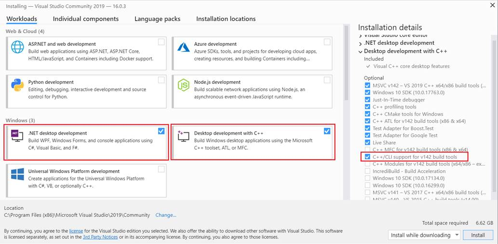
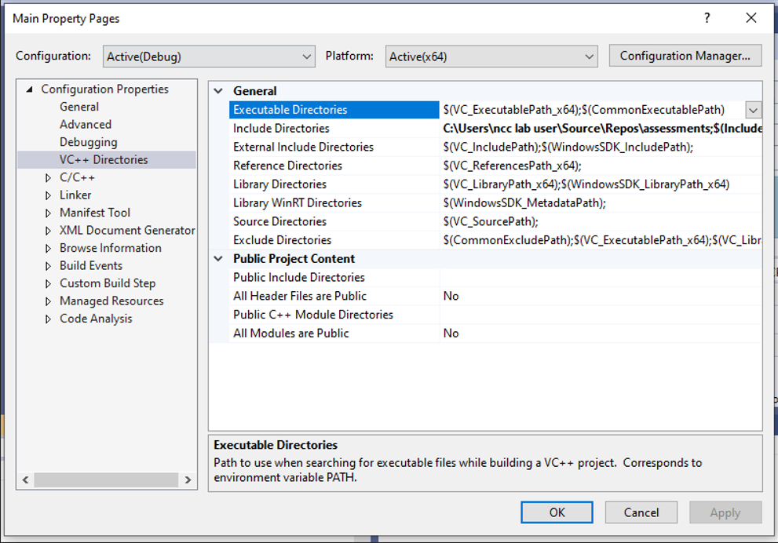
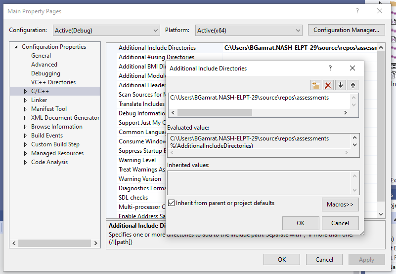
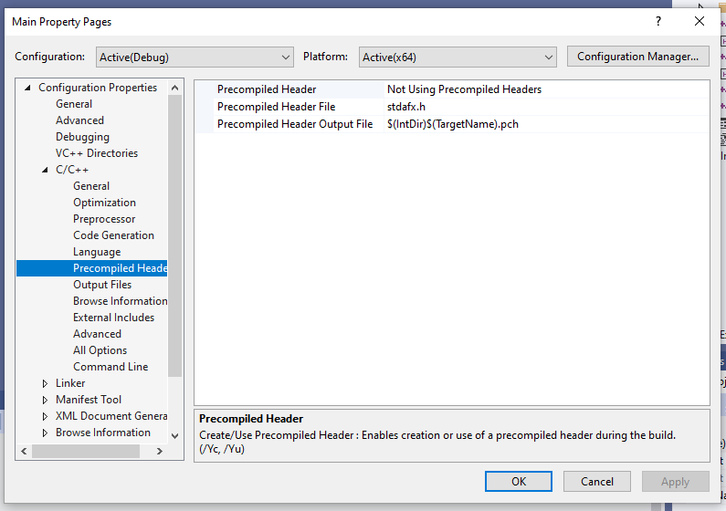

# Assessments Framework

## Team

### Tasks

#### Computation
- Mitchell Boone
- Michael Q
- Lim Costello

#### Visualization
- Samuel Bean
- Jesse Angelopolus
- Anthony Basque
- Nathan Jabbour

#### User Interface
- Samantha Hughson1
- Jacob Briand3
- Simeon Grosu
- Jared Gonsalves (c)

## Features

1. Dual-mode - will accept command line arguments, if none, will offer a GUI
1. Boost libraries included - curl, debug, json and tokenizer
1. Installer

# VS2019 Installation

Make sure red outlined options are selected in VS2019 installation

## Project Properties Fix

Add include path  

*If VS2019 can't find boost header files*

No precompiled headers  

## To add boost libraries into the project (current version is 1.78.0)

This has already been done, it is here for future reference. In most cases, there would be
instructions describing how to set boost up and it would be .gitignored. The boost libraries
used for this project are in the repo due to the nature of the development environment.

<https://www.boost.org/doc/libs/1_78_0/more/getting_started/windows.html>

<https://medium.com/@biswa8998/building-c-boost-and-using-bcp-exe-f89881b2cc60>

	change into boost directory and run bootstrap
	change into tools/bcp and run ..\..\b2
	change back up to the top of the boost directory
	bin.v2\tools\bcp\msvc-14.2\release\link-static\threading-multi\bcp.exe
	bin.v2\tools\bcp\msvc-14.2\release\link-static\threading-multi\bcp.exe debug tokenizer json ..\assessments

## To enable installer
<https://stackoverflow.com/a/54889614>

1. Enter Visual Studio .NET 2019 as administrator
1. Click on "Extensions" -> Manage Extensions -> Online
1. Type "Installer Project" on the search box
1. Click on "Install" in Microsoft Visual Studio Installer Project
1. Restart Visual Studio .NET and follow the instructions to install the extension
1. Rebuild install project
